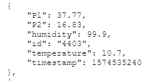

 Download,Parse,Store in DB, Queries

https://drive.google.com/drive/folders/18n1E2iBzcagheMBk0vGSkLnD6iBfxCvh?usp=sharing
   The data for each sensor can me additionally downloaded there

## Data Schema

3 Collections ( (1)raw , (2)correction(corrected raw) , (3)info - general info for each sensor)

As mongodb does not allow document with size >16 mb , and our document size is 12 mb for each sensor,
having a huge reading list for each sensor can cause problems. 
Thats why:

The (1)raw collection is composed of small documents - for each timestamp and location_id :

The (3)info collection is composed of small documents for each sensor: 

The  sensor raw collection will be sorted in the db by their location_id and timestamp.

if you run get_data.py , keep big_dump's folders empty, no checking for extra files.
